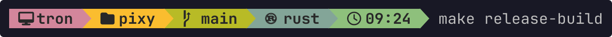
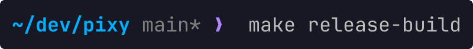
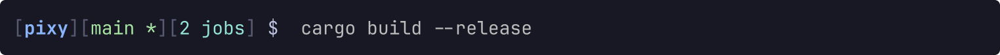
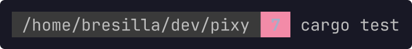
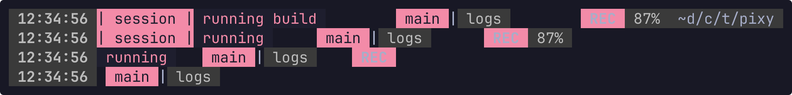
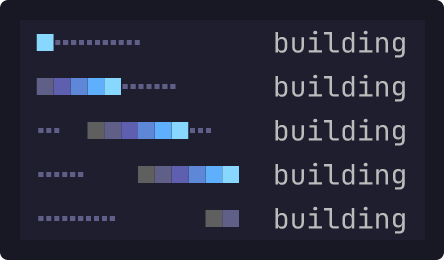

# Pixy

Lua decides what your terminal says. C hosts it, bounds it, and gets out of the way.

[](https://github.com/termworks/pixy/actions/workflows/tests.yml)
[](LICENSE)


Pixy paints prompts, status bars, titles and sprites. A Lua config defines named
**zones** made of ordered named **segments**; a caller asks for a whole zone or a
single `zone.segment`, and gets plain text, an ANSI prompt, styled runs, or a
bounded terminal surface.

What a prompt *is* lives entirely in your Lua. The host never learns the word
"branch", "battery" or "hostname" — it loads your config, enforces the limits,
prints the answer, and exits. No daemon, no rewriting of your shell config, no
second repository.

The host is C with Lua 5.4 compiled in: one static binary, no runtime, and
nothing to install beside it.

## Presets

Complete prompts, each one file you can copy to `~/.config/pixy/init.lua` and
edit. Every screenshot below is the same shell state — same directory, same
branch, same dirty tree — so what differs is the design, not the data.

```sh
pixy render prompt.left --config examples/presets/tokyo-night.lua --set cwd=$PWD
```

### Powerline

Solid blocks separated by arrow glyphs, the classic. Needs a Nerd Font.
→ [`examples/presets/powerline.lua`](examples/presets/powerline.lua)


### Tokyo Night

Rounded capsules in truecolour, one hue per kind of fact.
→ [`examples/presets/tokyo-night.lua`](examples/presets/tokyo-night.lua)


### Gruvbox Rainbow

Every block a different hue with arrows between them, and one palette table at
the top so recolouring the whole prompt is a single edit.
→ [`examples/presets/gruvbox-rainbow.lua`](examples/presets/gruvbox-rainbow.lua)



### Pure

No backgrounds, one accent colour, and a prompt mark that turns red when the
last command failed. Nothing here needs a patched font.
→ [`examples/presets/pure.lua`](examples/presets/pure.lua)



### Git Status

Everything about the working tree: branch, divergence, staged, unstaged,
untracked, stashed, conflicted. Counts come from the caller when it knows them,
and fall back to the bundled provider when it does not.
→ [`examples/presets/git-status.lua`](examples/presets/git-status.lua)


### Bracketed

Plain text, eight colours, no glyphs at all — the one to use over ssh into
something ancient.
→ [`examples/presets/bracketed.lua`](examples/presets/bracketed.lua)



## Writing one yourself

[`examples/minimal.lua`](examples/minimal.lua) — two segments and a priority:

```lua
local pixy = require("pixy")

return pixy.config({
  zones = {
    ["prompt.left"] = pixy.zone({
      pixy.segment("directory", function(ctx)
        return pixy.text(" " .. (ctx.values.cwd or "?") .. " ", {bg = 237, fg = 250})
      end, {priority = 1}),
      pixy.segment("status", function(ctx)
        if (ctx.values.status or 0) == 0 then return nil end
        return pixy.text(" " .. ctx.values.status .. " ", {bg = 1, fg = 15, bold = true})
      end, {priority = 5}),
    }),
  },
})
```



The status badge returns `nil` when the last command succeeded, and a segment
that returns `nil` takes no space. Priorities decide who survives when the
terminal is too narrow for everyone.

## Calling out to the world

[`examples/git.lua`](examples/git.lua) — a provider, cached:

```lua
local git = require("pixy.segments.git")

local function branch(ctx)
  local name = git.branch(ctx)
  if not name then return nil end
  return pixy.text(" " .. name .. " ", {bg = 4, fg = 0, bold = true})
end

local function dirty(ctx)
  if git.status(ctx) ~= "dirty" then return nil end
  return pixy.text(" ! ", {bg = 3, fg = 0})
end
```


`git.branch` runs one `git` process and caches the answer for `ttl_ms`, so a
prompt rendered twice in a second pays for one. A caller that already knows the
answer skips the process entirely:

```sh
pixy render prompt.right --config examples/git.lua --set git_branch=main --set git_status=dirty
```

## Width is an input

The same zone is a prompt at 26 columns and a status bar at 88. Segments drop by
priority as the room runs out, and `pixy.spacer()` absorbs whatever is left:

```lua
status = pixy.zone({
  pixy.segment("clock",   clock),
  pixy.segment("session", session),
  pixy.segment("gap1",    function() return pixy.spacer() end),
  pixy.segment("tabs",    tabs),
  pixy.segment("gap2",    function() return pixy.spacer() end),
  pixy.segment("battery", battery),
})
```



A spacer measures zero and is never pruned. Two of them centre the tabs;
`pixy.spacer(3)` takes three times the share of a plain one. Where the spacers
sit is what makes a zone left, centred or right — there is no alignment
vocabulary in the host.

At full width, that same zone is the bar:


## Animation without a timer

[`examples/spinner.lua`](examples/spinner.lua) — an animated node reports the
deadline of its next distinct frame, so a caller polls when the picture changes
rather than on a clock:

```lua
pixy.segment("spinner", function()
  return pixy.spinner({
    kind = "knight_rider",
    width = 12, step = 40, hold = 20,
    colors = {117, 75, 68, 61, 60, 59, 238, 237},
    bg = 0,
  })
end)
```



```sh
pixy render work --config examples/spinner.lua --now-ms 320   # one frame
pixy stream work --config examples/spinner.lua --fps 24 --duration 2000
```

Every render is deterministic in `now_ms`, which is why those five frames are
reproducible and why the tests can pin them.

## Surfaces

A surface is raw ANSI clipped to a rectangle you name — sprites, popups, pane
art. The binary embeds 1,017 regular and 1,017 shiny Pokémon, so this needs no
asset pack:

```sh
pixy render overlay --config examples/hexe-oslo.lua --mode surface \
  --width 34 --height 16 --context-json '{"values":{"sprite_name":"pikachu"}}'
```


## Install

Release builds for Linux are fully static musl binaries with no runtime
dependencies:

```sh
tar -xzf pixy-linux-amd64.tar.gz
install -m 755 pixy ~/.local/bin/pixy
```

From source:

```sh
nix develop            # zig, clang and the rest of the toolchain
make build             # debug
make release-build     # optimized
make release-musl      # static, this arch
```

Then wire it into a shell:

```sh
pixy init bash >> ~/.bashrc
pixy init zsh  >> ~/.zshrc
pixy init fish >> ~/.config/fish/config.fish
pixy init oslo             # prints the assignments, edits nothing
```

The integrations pass `status`, `duration_ms`, `jobs`, `language` and `vimode`
through `--set`. Those names are the integration's vocabulary, not Pixy's; a
config is free to expect entirely different ones.

For something complete rather than minimal, `pixy init hexe-oslo` prints the
bundled profile: prompt, status bar, spinner, sprite overlay, float titles and
popups. That profile is what the screenshot at the top of this page shows.

## Speed

The engine is not where prompts spend their time:

| | |
|---|---|
| one segment, warm, in process | 25 µs |
| a whole prompt, warm, in process | 0.17 ms |
| a whole prompt as a process, providers cached | 3 ms |
| the same prompt with every cache entry expired | ~26 ms |

What costs milliseconds is whatever your segments *call*. The bundled profile
shells out for the distro logo, the sudo ticket, the container kind and the
scratch count; those subprocesses dwarf everything above, so `pixy.host.exec`
caches each result by `ttl_ms` on disk, and a prompt whose providers are all
still fresh never leaves the process.

Give static things a long life (`ttl_ms = 86400000` for a distro logo that will
not change today), hand Pixy the values your shell already knows, and let the
cache absorb the rest. `make bench` prints the numbers for your machine.

## Painting a multiplexer

`pixy serve` speaks [hexe](https://github.com/termworks/hexe)'s painter protocol
over a Unix socket, so the zones that draw your prompt can draw the mux chrome —
status bar, pane and float titles, per-pane sprites:

```lua
-- ~/.config/hexe/init.lua
status = { enabled = true, view = "status", command = "pixy serve" }
```

hexe asks for a view at a width; Pixy answers with styled runs plus the clickable
regions inside them, and hexe never restyles what comes back. Save the config and
the bar repaints — `serve` reloads on write.

## Commands

| | |
|---|---|
| `pixy render <zone[.segment]>` | render once and exit |
| `pixy stream <zone>` | bounded animation, `--fps`, `--duration` |
| `pixy serve` | painter socket for hexe |
| `pixy list` · `pixy check` | inventory · config validation |
| `pixy init <shell>` | shell integration text |
| `pixy pack build\|check\|list` | sprite packs |

Output shapes are `--target plain\|ansi\|bash\|zsh` for a line, `--mode run` for
styled runs as JSON, and `--mode surface` for a bounded rectangle.

XDG throughout: config in `$XDG_CONFIG_HOME/pixy`, provider cache in
`$XDG_CACHE_HOME/pixy`, packs in `$XDG_DATA_HOME/pixy/packs` — each overridable
with `PIXY_CONFIG`, `PIXY_CACHE_DIR`, `PIXY_DATA_DIR`.

## Limits

Every render is a fresh query inside hard bounds: 32 MiB of Lua enforced by the
allocator, a 100 ms render deadline checked every 4096 instructions, a 250 ms
config load deadline, 2 s of host I/O per render, argv-only execution capped at
64 KiB of output, and reads confined to trusted roots. A config that loops
forever or shells out to something wedged gets stopped rather than hanging your
shell.

## Documentation

| | |
|---|---|
| [`docs/lua-api.md`](docs/lua-api.md) | zones, segments, nodes, styles |
| [`docs/architecture.md`](docs/architecture.md) | how the host is bounded |
| [`docs/cli.md`](docs/cli.md) | every command and flag |
| [`docs/hexe-oslo.md`](docs/hexe-oslo.md) | the bundled compatibility profile |
| [`docs/sprites.md`](docs/sprites.md) | sprite packs and surfaces |

The zone schema breaks between versions on purpose. After upgrading, regenerate a
generated config before testing the new binary:

```sh
pixy init hexe-oslo > ~/.config/pixy/init.lua && pixy check
```

## License

MIT — see [`LICENSE`](LICENSE). Sprite provenance and third-party notices live in
[`THIRD_PARTY.md`](THIRD_PARTY.md).

<sub>Every frame in this README is generated from live output by
<code>make docs-images</code>. Each is shown at its own size and one shared scale.</sub>
